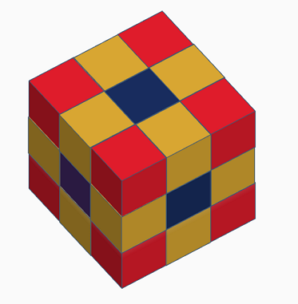

# 3D maze pathfinder

Find shortest path in a 3D maze with walls.

## Installation and use

The only required package is numpy that can be install as follows:

```bash
pip install numpy
```

In order to use this module, use the below code snippet in your Python script.
Some examples can also be found in the test.py file.

```python
from pathfinder import PathFinder3D

my_path_finder = PathFinder3D(maze, nb_move_directions=1)
my_path_finder.find_path(start, goal, alg='bfs')
```

See Documentation part below for more information on each parameters and what is returned by the `find_path` method.

## Approach

---

### Breadth First Search

I used first a regular Breadth First Search Algorithm (BFS) to find the shortest path between the start and the goal cell.  
This approach is straight forward and guarantees to return the shortest path but can be computer intensive for large mazes.  
This is mainly due to the fact that we check all positions in any directions from the starting point without taking into account the coordinates of the goal cell.  
It brings us to explore cells that are unlikely to be useful in the shortest path.

### A\* Search

The second approach was to implement the A\* search algorithm.  
This algorithm uses an heuristic to estimate how "interesting" a cell can be to explore.  
Here, I used the Manhattan distance which is simply the sum of the absolute value between a cell and the goal cell for each dimension.  
This heuristic is best suited when only single dimension moves are authorised each time (see below).  
This algorithm is much faster than the Breadth First Search however it does not guarantee

### Type of moves

I starting using single dimension moves (up, down, left, right, front and back) but wanted to see the impact of using diagonal moves.  
This can be changed when instanciating the `PathFinder3D` object by choosing the number of dimensions allowed.  
In the below picture, you can see which cells are reachable from the center one:

- 1 dimension: blue cells
- 2 dimensions: blue and orange cells
- 3 dimensions: blue, orange and red cells



### Performances

One concern especially with the BFS algorithm was the scalability.  
Requirement was to be able to solve cases in a 3D maze of dimension (40, 50, 60).

**With single dimension moves**  
Depending on the number of walls and the position of start and goal, the BFS requires between 4 and 10 seconds to find the shortest path on this size of maze.
The A\* search is usually between twice and three times faster and returns quite often the shortest path too.

**With higher dimension moves (2 and 3)**

## Documentation

---

The documentation allowing to instanciate an object PathFinder3D as well as find the path between a start cell and the goal cell is detailed below.  
The full documentation of the module is available in ./docs.

# <kbd>module</kbd> `pathfinder`

---

## <kbd>class</kbd> `PathFinder3D`

A class to find the path between 2 cells of a 3D maze.

The maze can have walls that cannot be traversed.

**Args:**

- <b>`maze`</b> (:obj:`numpy array`): The 3D maze should have zeros for usable cells and ones for walls.
- <b>`nb_move_directions`</b> (int, optional): The number of directions that can be taken in one move. Integer value between 1 and 3 (default is 1)

### <kbd>method</kbd> `PathFinder3D.__init__`

```python
__init__(maze, nb_move_directions=1) → None
```

---

### <kbd>method</kbd> `PathFinder3D.find_path`

```python
find_path(start, goal, alg='bfs')
```

Compute the path between a strat and a goal cell in a 3D maze

**Args:**

- <b>`start`</b> (list): Coordinates of the starting cell in the format [x, y, z]
- <b>`goal`</b> (list): Coordinates of the goal cell in the format [x, y, z]
- <b>`alg`</b> (str, optional): Two algorithms are available, 'bfs' for Breadth First Search or 'a_star' for A\* algorithm.

**Returns:**

- <b>`list`</b>: a list of coordinates [x, y, z] representing the path from the start cell to the goal. None if no path can be found.
